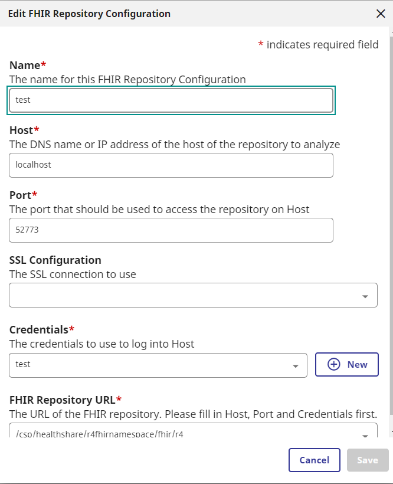

# FHIR SQL Builder お試し環境
デモ機でコンテナビルドするのに10分ぐらいかかります（FHIRリポジトリの作成に時間かかってます）

FHIRサンプルリソースデータのロードまで行っていますが、SQLビルダーは何も作成していません。

- [SQLビルダートップページ](localhost:9095/csp/fhirsql/index.html)
- FHIRリポジトリエンドポイント：/csp/healthshare/r4fhirnamespace/fhir/r4
- ネームスペース： R4FHIRNAMESPACE
- 事前定義ユーザのパスワード：SYS
- サンプルデータの場所（コンテナ内）：/patientdata
    
    ビルド時、ロードしてます。合計31件のPatientが登録されています

    GET http://localhost:9095/csp/healthshare/r4fhirnamespace/fhir/r4/Patient

- 設定時の注意
    
    [Repository Configurations](http://localhost:9095/csp/fhirsql/index.html#/repository-configuration)画面で登録する際のポートは、コンテナ内ポートを使用します。

    

## 使用しているIRISはコミュニティエディションです

containers.intersystems.com/intersystems/irishealth-community:2023.2.0.204.0

コンテナ以外で試していませんが、製品版の同じバージョンを利用した場合、Advanced ServerのSE用キーだとSQLビルダー画面が利用できず、Previewキーが必要でした。

ところが、Preview用キーでもSQLビルダ内のFHIRリポジトリ情報の登録で先に進めず、コミュニティエディションで試したところうまくいきました。（ローカル内のリポジトリに404エラーが出て接続できず先に進めませんでした。）
